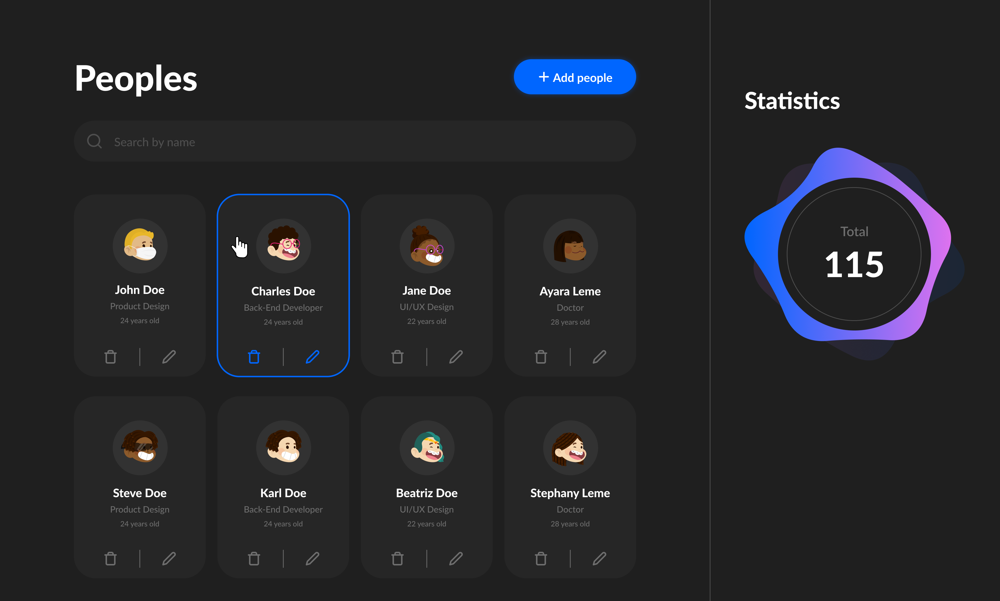

<div align="center">
  <h1>
    People Management - HR
  </h1>
  <span>
    a simple people management (HR) system created in Vanilla JS and front-end automation (gulp)
  </span>
  <br />
  <br />
  <br />
  
</div>

## Tecnologies

- gulp -> front-end automation
- gulp-babel -> transpile
- gulp-concat -> to generate bundle.js file
- gulp-sass -> convert scss file to css file

## Install the dependencies

```
npm i
```

## Run in development mode

```
npm start
```

## Generate production build

```
npm run build
```
